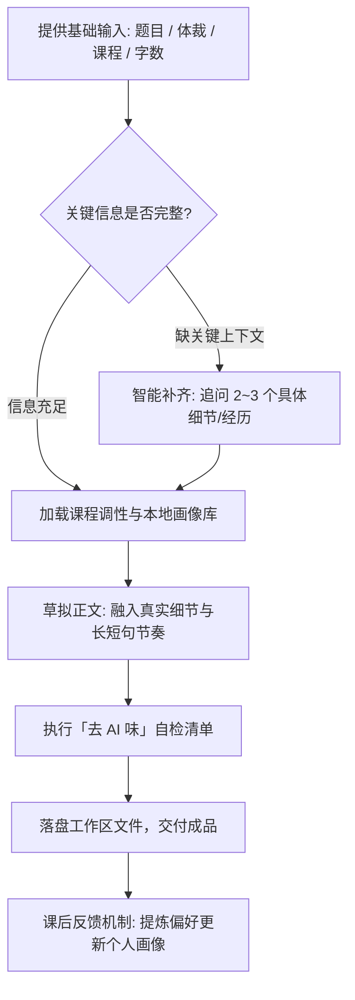

# 🎓 结课作业写作助手 (Coursework Writer)

<p align="center">
  <b>面向 DeepSeek Harness (DSH) 的深度拟真人学术作业写作模式</b><br>
  拒绝生硬模板与假大空套话，输出具有个人痕迹、文采斐然、深度契合课程调性的高质量结课作业。
</p>

<p align="center">
  <a href="https://github.com/YH-continuing/coursework-writer/stargazers"></a>
  <a href="https://github.com/YH-continuing/coursework-writer/releases"></a>
  
  
  <a href="./LICENSE"></a>
</p>

---

## 💡 为什么需要它？传统 AI 写作 vs 本助手

市面上通用的 ChatGPT / DeepSeek 提示词写出来的结课作业，往往充斥着浓重的**“AI 味”**——老师一眼就能看出来。本模式彻底重构了写作逻辑：

| 维度 | 常见通用大模型 / 传统提示词 | 结课作业写作助手 (本模式) |
| :--- | :--- | :--- |
| **逻辑连接** | 机械堆砌「首先、其次、再次、最后、总而言之」 | 叙述自然过渡，运用生活细节、疑问句与设问自然引出下文 |
| **句式结构** | 大量对称排比句、四字成语四六级堆叠 | 长短句错落，口吻自然，保留真实大学生的表达节奏与思考波折 |
| **名言引用** | 突兀且生硬地插入「正如著名哲学家 XX 所言」 | 将观点自然融化在句中，紧跟个人真实感悟，毫无生搬硬套之感 |
| **文章结尾** | 空洞喊口号、强行升华到宏大叙事 | 落地为真实生活观察或实践启发，言之有物，不浮夸 |
| **个性化记忆** | 每次会话重置，千篇一律 | **具备本地画像记忆**：自动积累你的真实经历与表达习惯，越写越像你 |

---

## ✨ 核心能力

- 📝 **全场景体裁覆盖**：
  - **结课论文**（论点清晰、学术规范与自主思考并重）
  - **读书报告 / 论文研读**（抓核心议题、个人反思）
  - **影视观后感 / 纪录片评论**（细节共情、视听语言分析）
  - **学习心得 / 研讨体会**（真实感触、结合大学生活动）
  - **社会调查 / 实践报告**（实事求是、数据事实支撑）
  - **结课 PPT 汇报稿与演讲逐字稿**（口语化、控场互动）
- 🎯 **极简四要素驱动**：只需输入 **题目、体裁、课程、字数**（可选特殊要求），即可自动化启动。
- 🔍 **克制且智能的追问**：仅在缺失核心前提时定向追问 3~4 个关键细节，绝无问卷轰炸。
- 🛡️ **交付前自检清单**：内置反套话审查机制，交稿前自动剔除排比堆砌、空洞口号与虚假套话。
- 🔒 **纯本地记忆与素材库**：个人画像、偏好反馈及过往经历沉淀**只保存在本机工作区**，安全不泄露。

---

## 🔄 写作执行流



---

## 🚀 极速安装与部署

> **前置条件**：系统已安装运行 **DeepSeek Harness (DSH)** 环境。

### 方式 A：一键在线安装（推荐）

#### 🔹 Windows 用户 (PowerShell)
以普通或管理员身份打开 PowerShell，粘贴运行：
```powershell
iex ([Text.Encoding]::UTF8.GetString((New-Object Net.WebClient).DownloadData('https://cdn.jsdelivr.net/gh/YH-continuing/coursework-writer@v1.0.0/install.ps1')))
```

> 为什么不用更短的 `irm ... | iex`？Windows PowerShell 5.1 会把下载内容按错误编码解码，导致中文提示变乱码（**不影响安装，只是提示难看**）。上面这行显式按 UTF-8 读取，中文提示就正常。

#### 🔹 macOS / Linux 用户 (Terminal)
打开终端，复制运行：
```bash
curl -fsSL https://cdn.jsdelivr.net/gh/YH-continuing/coursework-writer@v1.0.0/install.sh | bash
```

---

### 方式 B：国内备用镜像源安装

如果 jsDelivr 网络连接受限，可使用国内 Gitee 镜像加速或手动放置：

```bash
# 克隆仓库
git clone https://gitee.com/hu-youjun-114514/coursework-writer.git
# 将预设目录拷贝至 DSH 模式库
# Windows:
Copy-Item -Recurse "coursework-writer\preset\coursework-writer" "$HOME\.dsh\.agent-presets\"
# macOS/Linux:
cp -r coursework-writer/preset/coursework-writer ~/.dsh/.agent-presets/
```

安装完成后，**重启或刷新 DSH**，在模式选择列表中选择 **「结课作业写作」** 即可！

---

## 📖 最佳实践使用模板

在 DSH 模式选择器中选中 **「结课作业写作」**，直接发送任务提示词：

```text
题目：数字经济时代青年消费心理与理性审视
体裁：结课论文
课程：西方经济学（通识公选课）
字数：2500 字左右
要求：结合大学生的日常生活真实消费开销，引用恩格尔系数等概念，不要写成空洞口号。
```

它会根据你的要求，快速确认核心论述方向并自动完成撰写。

---

## ❓ 常见问题 (FAQ)

<details>
<summary><b>Q1: 安装完后在 DSH 模式列表里找不到该模式？</b></summary>
请完全关闭并重启 DSH 客户端，或在 DSH 的模式管理面板中点击“刷新预设列表”。确保预设文件夹位于 <code>~/.dsh/.agent-presets/coursework-writer/</code>。
</details>

<details>
<summary><b>Q2: 生成的作业能直接交吗？</b></summary>
虽然本模式在“去 AI 味”和语言自然度上做了大量优化，但我们始终建议：<b>将其作为高质量底稿与灵感骨干</b>。交稿前请结合自身实际通读一遍，补足你的真实小经历，这样既能保证 100% 契合课程，也是对学业诚信的负责。
</details>

<details>
<summary><b>Q3: 如何调整或定制默认写作规则？</b></summary>
可直接使用文本编辑器打开并修改：
<code>~/.dsh/.agent-presets/coursework-writer/agent.cordis.yml</code>
找到其中的 <code>persona.text</code> 字段，即可调整提示词约束与风格。
</details>

---

## 📄 许可证

本项目基于 [MIT License](./LICENSE) 开放源代码。
欢迎 Star ⭐️ 支持与提交 Issue / PR 交流！
